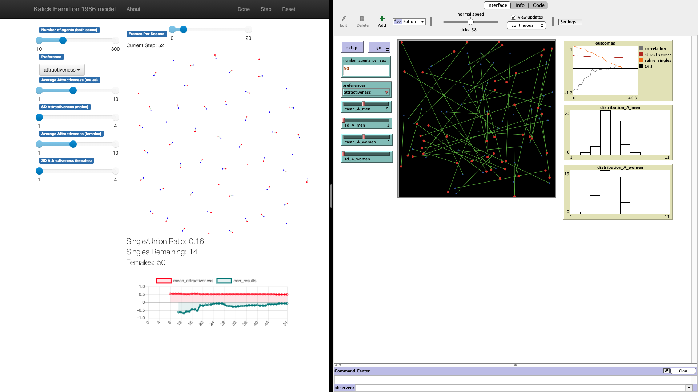

# Kalick, S. M., & Hamilton, T. E. (1986). The matching hypothesis reexamined

A model following [Andre Grow](https://www.andre-grow.net/simulation-models)'s Netlogo tutorial of Kalick & Hamilton, 1986<sup>1</sup> replicated using Mesa in Python. I have took impression and code from multiple [Mesa examples](https://github.com/projectmesa/mesa/tree/master/examples) in this prototype.



1. Kalick, S. M., & Hamilton, T. E. (1986). The matching hypothesis reexamined. Journal of Personality and Social Psychology, 51(4), 673–682. https://doi.org/10.1037/0022-3514.51.4.673


## Installation

To install the dependencies use pip and the requirements.txt in this directory. e.g.

```
    $ pip install -r requirements.txt
```

## How to Run

To run the model interactively, run ``mesa runserver`` in this directory. e.g.

```
    $ mesa runserver
```

Then open your browser to [http://127.0.0.1:8521/](http://127.0.0.1:8521/) and press Reset, then Run.

## Files

* ``run.py``: Launches a model visualization server.
* ``./kalick_hamilton_grow/model.py``: Contains the agent class, and the overall model class.
* ``./kalick_hamilton_grow/server.py``: Defines classes for visualizing the model (network layout) in the browser via Mesa's modular server, and instantiates a visualization server.
* ``batch_run.py``: Allows parameter combinations to do factorial experiments that Grow discussed in his tutorial (this is similar to Netlogo's behavior space). Exports results for both model parameters and agent reporters into CSV files in `data` folder (see an example there.)
* ``interactive_run.ipynb``: Imports the model without visual server and allows running with different parameters to analyze the results in Jupyter Notebook. Also, imports CSV files exported from `batch_run.py` in `data` folder and allows further analysis in Jupyter Notebook.

## Further Reading on Mesa

The full tutorial describing how the model is built can be found at:
http://mesa.readthedocs.io/en/master/tutorials/intro_tutorial.html


## Contribution
Main credit here goes to [Andre Grow](https://www.andre-grow.net/simulation-models) for his tutorial on the model and Netlogo implementation and the [Mesa](https://github.com/projectmesa/mesa/) team for their great implementation that makes ABM prototyping in Python easy. Please fork the repository and add proper citation. Please let me know if you spot errors or problems through a brief issue in this repository.
